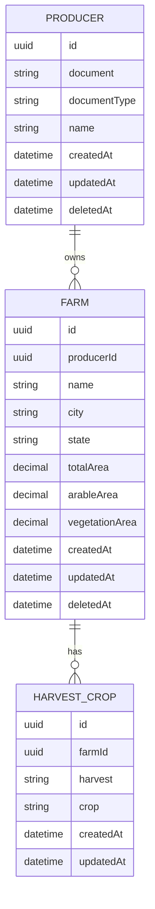
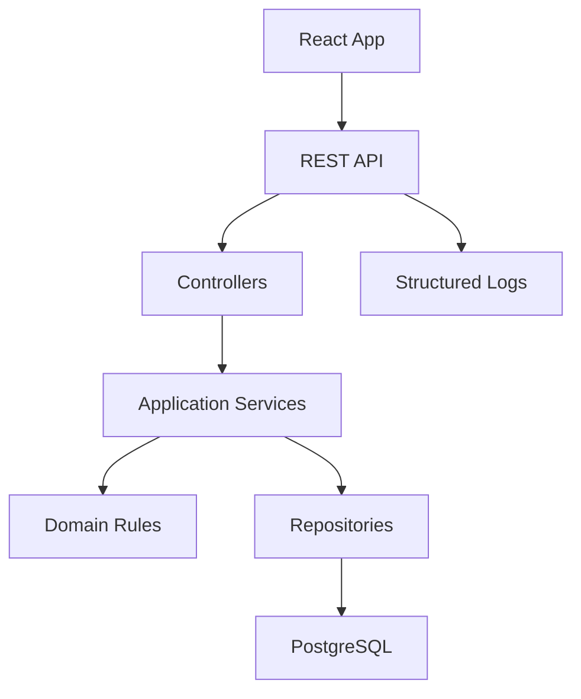

# Brain Agriculture - Especificacao

## 1. Contexto

A aplicacao Brain Agriculture gerencia produtores rurais, suas propriedades, safras e culturas plantadas. O sistema deve permitir operacoes CRUD e consolidar dados em um dashboard operacional.

## 2. Objetivos

- Manter um cadastro confiavel de produtores rurais.
- Permitir que um produtor tenha multiplas propriedades.
- Registrar culturas plantadas por safra em cada propriedade.
- Validar documentos e regras de area.
- Expor indicadores agregados para tomada de decisao.

## 3. Requisitos Funcionais

### RF01 - Cadastrar produtor

O sistema deve permitir cadastrar um produtor com CPF ou CNPJ, nome e uma lista opcional de propriedades.

Regras:

- CPF e CNPJ devem ser validos.
- O documento deve ser unico.
- Um produtor pode ser cadastrado sem propriedades.

### RF02 - Editar produtor

O sistema deve permitir alterar os dados cadastrais do produtor e suas propriedades.

Regras:

- Ao alterar CPF ou CNPJ, o novo documento deve continuar valido e unico.
- Alteracoes de propriedades devem respeitar as validacoes de area.

### RF03 - Excluir produtor

O sistema deve permitir excluir um produtor.

Regras:

- A exclusao deve remover ou inativar suas propriedades e culturas relacionadas, conforme a estrategia de persistencia escolhida.
- Recomenda-se soft delete para manter historico operacional.

### RF04 - Gerenciar propriedades rurais

O sistema deve permitir cadastrar, editar e excluir propriedades associadas a um produtor.

Campos:

- Nome da fazenda.
- Cidade.
- Estado.
- Area total em hectares.
- Area agricultavel em hectares.
- Area de vegetacao em hectares.

Regras:

- `areaAgricultavel + areaVegetacao` nao pode ultrapassar `areaTotal`.
- Areas devem ser maiores ou iguais a zero.
- Area total deve ser maior que zero.

### RF05 - Registrar culturas por safra

O sistema deve permitir registrar varias culturas plantadas por propriedade e safra.

Campos:

- Safra, exemplo: `Safra 2021`.
- Cultura, exemplo: `Soja`, `Milho`, `Cafe`.

Regras:

- Uma propriedade pode ter zero, uma ou varias culturas por safra.
- A mesma cultura nao deve ser duplicada na mesma propriedade e safra.

### RF06 - Dashboard

O sistema deve exibir os seguintes indicadores:

- Total de fazendas cadastradas.
- Total de hectares registrados.
- Grafico de pizza por estado.
- Grafico de pizza por cultura plantada.
- Grafico de pizza por uso do solo, considerando area agricultavel e vegetacao.

## 4. Requisitos Nao Funcionais

- Codigo escrito com TypeScript no frontend e backend Node.
- Arquitetura em camadas.
- Baixo acoplamento entre controllers, services, repositories e entidades.
- Testes unitarios para regras de negocio.
- Testes integrados para endpoints principais.
- Logs estruturados para operacoes relevantes e erros.
- Contrato OpenAPI versionado no repositorio.
- Aplicacao distribuivel com Docker.

## 5. Modelo de Dominio

### Producer

Representa o produtor rural.

Campos:

- `id`
- `document`
- `documentType`
- `name`
- `createdAt`
- `updatedAt`
- `deletedAt`

Relacionamentos:

- Um produtor possui zero ou varias propriedades.

### Farm

Representa uma propriedade rural.

Campos:

- `id`
- `producerId`
- `name`
- `city`
- `state`
- `totalArea`
- `arableArea`
- `vegetationArea`
- `createdAt`
- `updatedAt`
- `deletedAt`

Relacionamentos:

- Uma propriedade pertence a um produtor.
- Uma propriedade possui zero ou varias culturas plantadas por safra.

### HarvestCrop

Representa uma cultura plantada em uma safra especifica.

Campos:

- `id`
- `farmId`
- `harvest`
- `crop`
- `createdAt`
- `updatedAt`

Relacionamentos:

- Uma cultura/safra pertence a uma propriedade.

## 6. Diagrama de Entidades



## 7. Arquitetura Recomendada



Camadas:

- `controllers`: recebem requisicoes HTTP, validam DTOs e delegam casos de uso.
- `services`: concentram fluxos de aplicacao.
- `domain`: regras puras, como validacao de documento e validacao de areas.
- `repositories`: acesso ao banco via ORM.
- `infra`: configuracoes, logs, banco, observabilidade e adapters externos.

## 8. Endpoints Principais

### Producers

- `POST /producers`
- `GET /producers`
- `GET /producers/{producerId}`
- `PUT /producers/{producerId}`
- `DELETE /producers/{producerId}`

### Farms

- `POST /producers/{producerId}/farms`
- `GET /producers/{producerId}/farms`
- `GET /farms/{farmId}`
- `PUT /farms/{farmId}`
- `DELETE /farms/{farmId}`

### Harvest Crops

- `POST /farms/{farmId}/harvest-crops`
- `GET /farms/{farmId}/harvest-crops`
- `PUT /harvest-crops/{harvestCropId}`
- `DELETE /harvest-crops/{harvestCropId}`

### Dashboard

- `GET /dashboard`

## 9. Contratos de Validacao

### CPF/CNPJ

- Remover pontuacao antes de persistir.
- Identificar tipo do documento pela quantidade de digitos.
- Validar digitos verificadores.
- Rejeitar sequencias repetidas, como `11111111111`.

### Area

Formula:

```text
areaAgricultavel + areaVegetacao <= areaTotal
```

Erros esperados:

- `INVALID_DOCUMENT`
- `DOCUMENT_ALREADY_EXISTS`
- `INVALID_FARM_AREA`
- `PRODUCER_NOT_FOUND`
- `FARM_NOT_FOUND`
- `HARVEST_CROP_ALREADY_EXISTS`

## 10. Dashboard

Resposta esperada:

```json
{
  "totalFarms": 12,
  "totalArea": 2400.5,
  "byState": [
    { "state": "MT", "total": 5 }
  ],
  "byCrop": [
    { "crop": "Soja", "total": 7 }
  ],
  "byLandUse": {
    "arableArea": 1800.25,
    "vegetationArea": 600.25
  }
}
```

## 11. Estrategia de Testes

Testes unitarios:

- Validacao de CPF.
- Validacao de CNPJ.
- Validacao da soma de areas.
- Regra de duplicidade de cultura por propriedade e safra.

Testes integrados:

- Criacao de produtor com propriedade.
- Rejeicao de documento invalido.
- Rejeicao de area invalida.
- Atualizacao e exclusao de produtor.
- Retorno do dashboard com agregacoes corretas.

## 12. Observabilidade

Logs recomendados:

- Criacao, atualizacao e exclusao de produtor.
- Falhas de validacao.
- Erros inesperados com correlation id.
- Tempo de resposta por endpoint.

Formato sugerido:

```json
{
  "level": "info",
  "message": "producer.created",
  "producerId": "uuid",
  "requestId": "uuid",
  "timestamp": "2026-05-26T10:00:00.000Z"
}
```

## 13. Criterios de Aceite

- O sistema permite CRUD completo de produtores.
- CPF e CNPJ invalidos sao rejeitados.
- A soma das areas agricultavel e vegetacao nunca ultrapassa a area total.
- Um produtor pode ter multiplas propriedades.
- Uma propriedade pode ter multiplas culturas por safra.
- O dashboard retorna totais e agrupamentos corretos.
- O contrato OpenAPI descreve os endpoints principais.
- Testes automatizados cobrem as regras de negocio criticas.
